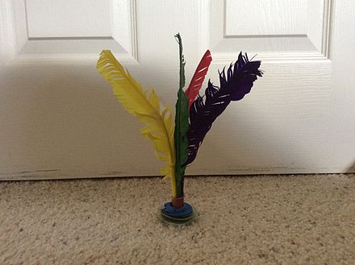

# Jianzi

[切换至中文 (Switch to Chinese)](../../中文/游戏/踢毽子.md)

## Game Basics

A Jianzi is similar to a shuttlecock. The difference is that a Jianzi is heavily weighted and has larger but fewer feathers.

During the game, players can use any part of their body except their hands to keep the shuttlecock off the ground. It is mainly balanced and propelled upwards with the legs, especially the feet. Skilled players might even use an overhead kick. The game can be played by a group of people or just a single person.

The game is similar to freestyle football, except that a Jianzi instead of a football is used. 

## Game History

Jianzi is likely originated during the Han Dynasty (206 BC to 220 AD) and became popular during the Six Dynasties (Three Kingdoms and Northern/Southern Dynasties), Sui Dynasty, and Tang Dynasty. Some historians believe it developed from "cuju." Many ancient texts record the game of jianzi. Over the centuries, jianzi spread throughout Asia, with different names in various regions.

In 1936, an athlete from Jiangsu performed jianzi at the Summer Olympics in Berlin, which then introduced the sport to Europe. Since then, people in Germany and other countries have begun to learn and play the game.

## References
- https://en.wikipedia.org/wiki/Jianzi
- https://baike.baidu.com/item/%E8%B8%A2%E6%AF%BD/6724574