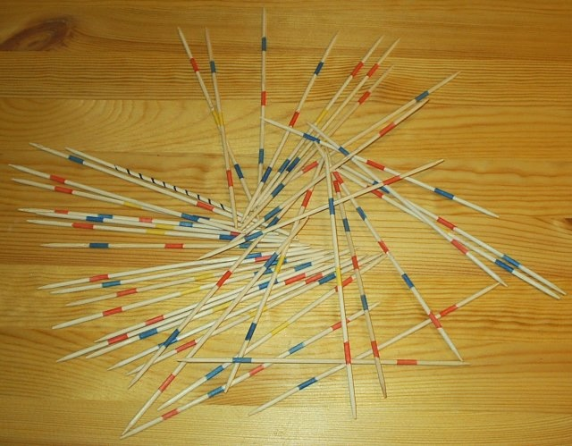

# 挑棍子

[Switch to English (切换至英文)](../../English/Games/Mikado.md)

## ​游戏基础

开始时，一个人应该用一只手握住所有的棍子，将它们垂直放在一个平面上，然后松手。(有些情况下，游戏用的是冰棒棍，而不是上图中的圆棍）。如此一来，棍子就会相互倒在一起，看起来就如下图一般。

 

然后，两位玩家依次尝试在移动其他木棒的情况下从木棒堆中取出一根木棒。如果他们做到了，就可以保留这根棍子。在某些地区的游戏变种中，玩家在游戏开始时会获得一根棍子作为帮助他们的工具。而在其他版本中，玩家只能使用自己已经获得的棍子来帮助自己。

游戏在所有棍子都被拿走后结束。此时，每个玩家都应该积累了一批棍子。一般来说，持有最多木棒的玩家获胜。在某些复杂的版本中，所得的分数还与棍子上的颜色有关联。玩家算出求出自己的总积分，然后比较大小。

## 游戏历史

挑棍游戏的起源可以追溯到古代欧洲。后来游戏传入古代中国，当时人们用竹简玩这种游戏。再后来，这种游戏传入日本，在贵族中流行起来，被称为 "御家人的游戏"。

随着时间的推移，游戏材料也从最初的竹签演变成更耐用的木棍、塑料棍或金属棍。不过，从最早的版本开始，小心翼翼地从一堆杂乱无章的棍子中取出单个棍子的核心玩法基本保持不变。

​1978 年中国改革开放之后，该游戏在中国再次流行起来。随着越来越多的家庭摆脱极端贫困，人们对娱乐的需求也随之增加，尤其是儿童。这种只需要几根冰棒棍就能玩的游戏正好满足了这种日益增长的需求。

## 参考文献
- https://www.sohu.com/a/594422325_121124211
- https://en.wikipedia.org/wiki/Mikado_(game)
- https://baike.baidu.com/item/%E6%8C%91%E6%A3%8D%E6%B8%B8%E6%88%8F/4095129