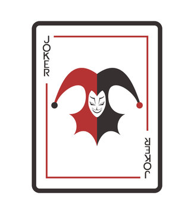

# 斗地主

[Switch to English (切换至英文)](../../English/Games/Fight%20the%20Landlord.md)

## 游戏基础

斗地主是一款流行的中国纸牌游戏，涉及三名玩家——两名“农民”合作对抗一名“地主”。游戏的目标是农民共同努力击败地主。

游戏使用一副标准的54张牌，包括两张大小王。牌的大小从3（最低）到A、2，最后是两张大小王（最高）。

游戏开始时，每位玩家会发到17张牌。通常拥有黑桃3的玩家首先竞拍地主位置。玩家依次竞拍，告诉其他玩家他们愿意接受的风险（在过去，玩家会下注钱。然而，如今在中国下注被视为非法赌博）。出价最高的玩家获得地主位置。

玩家轮流出牌，地主首先出牌。在一轮中，玩家必须出比前一轮更高等级的牌。地主可以出任何合法的牌组，而农民如果可能的话可以跟牌。

以下是[百度百科](https://baike.baidu.com/item/%E6%96%97%E5%9C%B0%E4%B8%BB/177997)所收录的所有合法的牌组：

| 牌型 | 牌型说明 |
| --- | ------------------- |
| 火箭 | 即双王（双鬼牌），什么牌型都可打，是最大的牌。 |
| 炸弹 | 四张同点牌。如四个5。除火箭和比自己大的炸弹外，什么牌型都可打。 |
| 单个牌 | 单张牌，比如3。 |
| 对子牌 | 两个点数相同的牌。 |
| 三张牌 | 三张点数相同的牌。 |
| 三带一 | 三张同点牌 + 一张单牌。例如：三张3+单4。 |
| 三带二 | 三张同点牌 + 一对牌。例如：三张3+对4。 |
| 单顺子 | 五张或更多连续的单牌。例如：单3+单4+单5+单6+单7。不包括2点和双王。 |
| 双顺子 | 三对或更多连续的对牌。例如：对3+对4+对5。不包括2点和双王。 |
| 三顺子 | 二个或更多连续的三张牌。例如：三张3+三张4+三张5。不包括2点和双王。也叫飞机不带翅膀。 |
| 飞机带翅膀 | 三顺+同数量的单牌（或同数量的对牌）。 |
| 四带二 | 四张牌+任意两张单牌（或任意两对牌）例如：四张5+单3+单8或 四张4+对5+对7 |

## 游戏历史

斗地主起源于湖北武汉汉阳一带，是职业扑克家严军和他朋友们根据另一种当地流行的扑克玩法改编的。

由于在另一种玩法需要多于3个人，因此经常在人数不足的情况下开始。起初并不叫斗地主，他们圈内的人叫“二打一”。最初的“二打一”总共54张牌，每个玩家发18张牌，不留三张底牌，只是一个玩家从另外的两个玩家手里各随机抽取一张牌，被抽牌的玩家共同协作对付抽牌的玩家，这样慢慢演变成了“斗地主”。

1995年，“二打一”正式命名为“斗地主”。如今已风靡整个中国，并流行于互联网上。

## 参考文献
- https://en.wikipedia.org/wiki/Dou_dizhu#Variations
- https://baike.baidu.com/item/%E6%96%97%E5%9C%B0%E4%B8%BB/177997
