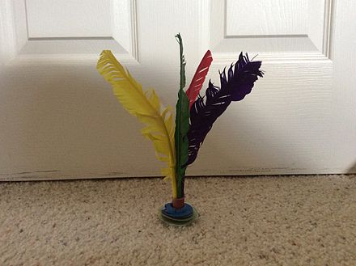

# 踢毽子

[Switch to English (切换至英文)](../../English/Games/Jianzi.md)

## 游戏基础

踢毽子所用的毽子类似于羽毛球，不同之处在于毽子更重，羽毛更大，数量更少。

在游戏过程中，玩家可以使用身体除了手以外的任何部位来防止毽子落地。主要使用小腿和脚来保持毽子的平衡并将其向上踢起。这个游戏可以由一群人一起玩，也可以单人玩。不过无论人数，目的都是让毽子保持在空中。

踢毽子类似于花式街头足球，只是毽子而不是足球。

## 游戏历史

踢毽子毽子这个游戏很可能是汉代（公元前206年至公元220年）时期所发明的，并在六朝（三国和南北朝）、隋朝和唐朝时期广受欢迎。部分历史学家认为它起源于“蹴鞠”。许多古籍中都有关于毽子游戏的记载。几个世纪以来，毽子传遍了整个亚洲，在不同地区有不同的名称。

1936年，一位来自江苏的中国运动员在柏林夏季奥运会上进行了毽子表演，这项运动随后传到了欧洲。此后，德国和其他国家的人们开始学习和玩这项运动。

## 参考文献
- https://en.wikipedia.org/wiki/Jianzi
- https://baike.baidu.com/item/%E8%B8%A2%E6%AF%BD/6724574